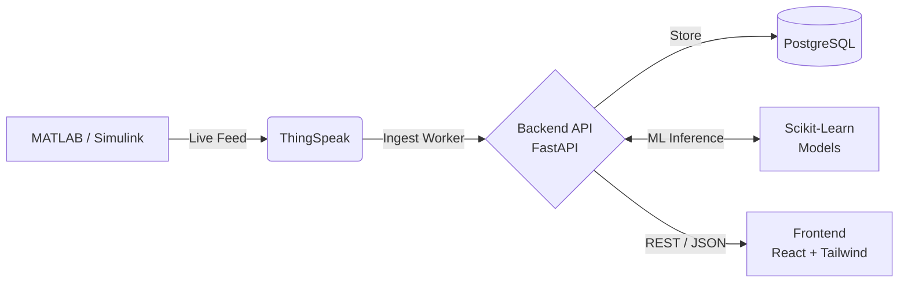

# EV Wireless Power Transfer (WPT) Monitor

A full-stack, real-time telemetry dashboard for Wireless Power Transfer (WPT) EV charging. It ingests live electrical data (Voltage, Current, Power, SOC) from ThingSpeak, processes it through 3 custom Machine Learning models (Soft-Sensor Temperature, Anomaly Detection, Battery Health), and displays it on a premium React/Tailwind dashboard.

 <!-- Add a screenshot here later! -->

---

## 🏗️ Architecture

---

## 🧠 The 3-Tier Data Resolver (Fail-Safe Ingestion)

The backend ingestion worker runs on an APScheduler every 3 seconds and utilizes an intelligent **3-Tier Data Resolution** strategy to ensure the dashboard *never* crashes, even if the internet drops or MATLAB is stopped.

1. 🟢 **LIVE (ThingSpeak)**: If fresh data arrives from ThingSpeak, the system scales the pack-level data down to cell-level, runs inference, and displays a green "Live" badge.
2. 🟡 **REPLAY (Demo Mode)**: If live data is unavailable, it automatically falls back to streaming a seeded, realistic charge-cycle from a local CSV (`nev_battery_charging.csv`). This is your interview safety-net!
3. 🔴 **LAST-KNOWN**: If the system detects a stall, it simply serves the most recent stored DB row and turns the badge Red, showing exactly how stale the data is.

---

## 🎙️ Interview Talking Points

### 1. The Machine Learning Pipeline (`ml/`)
- **What it does**: We trained 3 models on NASA Li-ion battery datasets: a Temperature Soft-Sensor, an Anomaly Detector, and a Battery Health Classifier.
- **Why it matters**: We don't rely on physical temperature sensors. The soft-sensor *predicts* temperature entirely from the electrical signals (Voltage, Current, Time). This predicted temperature is then fed into the Anomaly model.
- **The "Pack to Cell" fix**: The ML models were trained on 3.7V cell data, but our live ThingSpeak data is ~390V pack data. Before running inference on live data, the backend normalizes the Pack data down to Cell-level by dividing by the number of series/parallel cells.

### 2. The Backend (`webdev/backend/`)
- **What it does**: A high-performance FastAPI application connected to a PostgreSQL database using SQLAlchemy.
- **Why it matters**: It acts as a strict boundary between ThingSpeak and the Frontend. The React app *never* talks to ThingSpeak directly. This allows us to persist every single reading locally and run heavy ML inference on the server without freezing the user's browser.
- **The Schema**: 4 simple tables: `channels` (hides credentials), `readings` (raw telemetry), `predictions` (the ML output), and `alerts` (system warnings).

### 3. The Frontend (`webdev/frontend/`)
- **What it does**: A React Single Page Application (SPA) built with Vite, styled with Tailwind CSS v4, and using Framer Motion for elegant entrance animations.
- **Why it matters**: It's completely decoupled from the backend. It just polls the FastAPI endpoints (`/api/readings/latest`). It uses a strict, premium "shadcn" aesthetic (Zinc dark mode) for a highly professional look, far beyond standard bootstrap dashboards.

---

## 🚀 Deployment Guide

Everything is configured to deploy for free across 3 platforms: **Neon** (Database), **Render** (Backend), and **Vercel** (Frontend).

### 1. Neon (PostgreSQL Database)
1. Go to [neon.tech](https://neon.tech/) and sign up.
2. Create a new project (e.g., `ev-wpt-db`).
3. On the dashboard, find your **Connection String** (it starts with `postgresql://`). Copy this.

### 2. Render (Backend API)
1. Go to [render.com](https://render.com/) and sign up with GitHub.
2. Click **New +** -> **Web Service**.
3. Connect your GitHub repository.
4. Render will automatically read the `render.yaml` file in this repository and configure everything!
5. **CRITICAL**: Go to the "Environment" tab of your new Web Service on Render and add the following Environment Variables:
   - `DATABASE_URL` = (Paste your Neon connection string here)
   - `THINGSPEAK_CHANNEL` = (Your ThingSpeak Channel ID, e.g., `3311497`)
   - `THINGSPEAK_READ_KEY` = (Your ThingSpeak Read API Key)
6. Click Save. Render will build the project, train the ML models, and start FastAPI. Copy your Render URL (e.g., `https://ev-wpt-api.onrender.com`).

### 3. Vercel (Frontend Dashboard)
1. Go to [vercel.com](https://vercel.com/) and sign up with GitHub.
2. Click **Add New Project** and select this GitHub repository.
3. In the "Framework Preset" dropdown, Vercel should auto-detect **Vite**.
4. **Root Directory**: Click Edit and type `webdev/frontend`. This tells Vercel where the React app lives.
5. Expand "Environment Variables" and add:
   - `VITE_API_URL` = (Paste your Render backend URL here, e.g., `https://ev-wpt-api.onrender.com`)
6. Click **Deploy**.

🎉 You are live!
