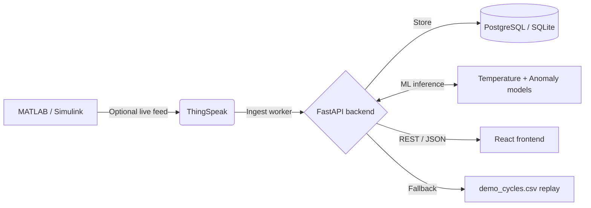

# EV Wireless Power Transfer (WPT) Monitor

A full-stack, real-time telemetry dashboard for wireless power transfer EV charging. The system ingests voltage, current, power, and state-of-charge data from ThingSpeak when configured, runs two production machine-learning models, stores readings in PostgreSQL or SQLite, and presents the results in a React dashboard.

## Active architecture



The backend uses a three-tier source resolver. It first accepts genuinely new ThingSpeak data, falls back to the recorded `webdev/backend/data/demo_cycles.csv` stream when no live source is configured or available, and preserves the last stored reading when a configured live source has temporarily stopped producing new data. The dashboard indicates freshness and source status without connecting to ThingSpeak directly.

## Machine-learning models

| Model | Type | Input | Dashboard use |
|---|---|---|---|
| Temperature soft-sensor | Supervised regression using Random Forest | Voltage, current, derived power, and time | Temperature gauge and over-temperature alerts |
| Anomaly detector | Unsupervised Isolation Forest | Voltage, current, derived power, and predicted temperature | Anomaly status and alerts |

The Render build downloads the NASA Li-ion Battery Aging dataset, trains these two models, and writes the generated model files to `ml/models/`. The raw training dataset is intentionally not committed to Git.

## Repository layout

| Path | Purpose |
|---|---|
| `ml/` | Dataset download, feature preparation, model training, and runtime inference |
| `webdev/backend/` | FastAPI service, scheduled ingestion, replay fallback, database models, and alerts |
| `webdev/frontend/` | Vite/React dashboard for telemetry, charts, model information, and architecture |
| `render.yaml` | Render build and start commands |
| `.github/workflows/keep-warm.yml` | Scheduled health checks that reduce Render free-tier cold starts |

## Local development

Install the backend dependencies and start the API from its directory:

```bash
cd webdev/backend
pip install -r requirements.txt
uvicorn main:app --reload
```

The backend defaults to SQLite and replay mode, so no database or ThingSpeak account is required for a local demo. To train the models locally, run the following from `ml/`:

```bash
pip install -r requirements.txt
python get_data.py
python train.py
```

In another terminal, install and start the frontend:

```bash
cd webdev/frontend
npm install
npm run dev
```

The Vite development server proxies `/api` requests to `http://localhost:8000`.

## Deployment

The intended deployment uses Neon for PostgreSQL, Render for the FastAPI backend, and Vercel for the frontend.

### Render backend

Create a Render web service connected to this repository. Render reads `render.yaml`, installs both dependency manifests, downloads the training data, trains the two models, and starts Uvicorn. Configure these environment variables in Render:

```text
DATABASE_URL=your Neon PostgreSQL connection string
THINGSPEAK_CHANNEL=your optional ThingSpeak channel ID
THINGSPEAK_READ_KEY=your optional ThingSpeak read key
```

### Vercel frontend

Set the Vercel root directory to `webdev/frontend` and configure the frontend with the deployed Render URL:

```text
VITE_API_BASE=https://your-render-service.onrender.com
```

The frontend reads `VITE_API_BASE`; `VITE_API_URL` is not used by the application.

## API endpoints

The backend exposes `/health`, `/api/readings/latest`, `/api/readings?limit=`, `/api/alerts?limit=`, and `/api/analytics/summary`. The frontend polls these endpoints every three seconds.

## Live deployment

The project is available at [wpt-iot.vercel.app](https://wpt-iot.vercel.app).
