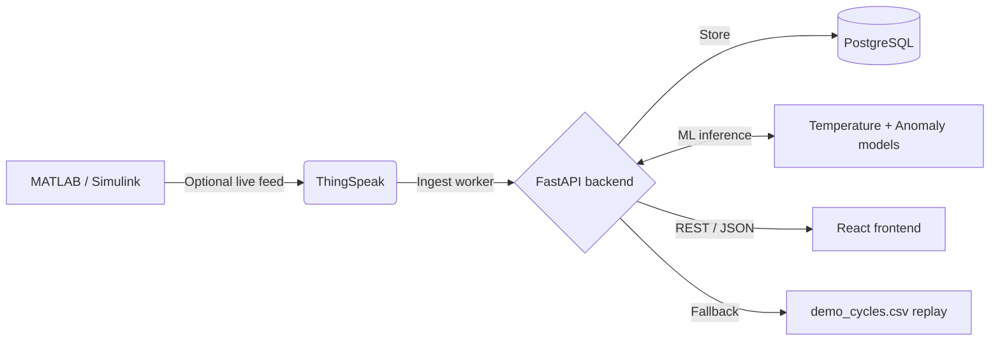

# EV Wireless Power Transfer (WPT) Monitor

A full-stack, real-time telemetry dashboard for wireless power transfer EV charging. The system ingests voltage, current, power, and state-of-charge data from ThingSpeak when configured, runs two production machine-learning models, stores readings in PostgreSQL, and presents the results in a React dashboard.

## Active architecture

The backend uses a three-tier source resolver. It first accepts genuinely new ThingSpeak data, falls back to the recorded `webdev/backend/data/demo_cycles.csv` stream when no live source is configured or available, and preserves the last stored reading when a configured live source has temporarily stopped producing new data. The dashboard indicates freshness and source status without connecting to ThingSpeak directly.

## Machine-learning models

| Model | Type | Input | Dashboard use |
|---|---|---|---|
| Temperature soft-sensor | Supervised regression using Random Forest | Voltage, current, derived power, and time | Temperature gauge and over-temperature alerts |
| Anomaly detector | Unsupervised Isolation Forest | Voltage, current, derived power, and predicted temperature | Anomaly status and alerts |

The Render build downloads the NASA Li-ion Battery Aging dataset, trains these two models, and writes the generated model files to `ml/models/`. The raw training dataset is intentionally not committed to Git.

## Repository layout

| Path | Purpose |
|---|---|
| `ml/` | Dataset download, feature preparation, model training, and runtime inference |
| `webdev/backend/` | FastAPI service, scheduled ingestion, replay fallback, database models, and alerts |
| `webdev/frontend/` | Vite/React dashboard for telemetry, charts, model information, and architecture |

